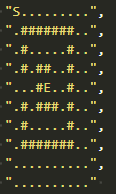
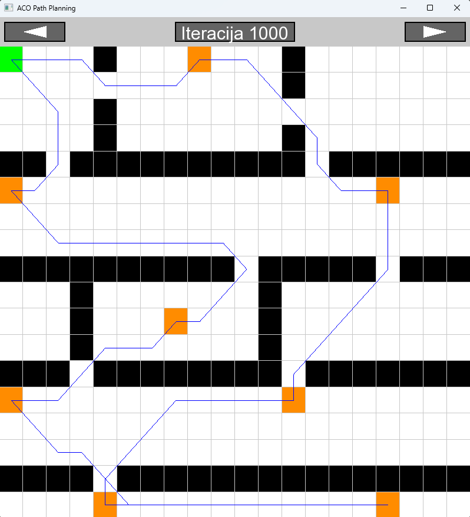

# ACO (Ant Colony Optimization) for Path Planning

This project implements an Ant Colony Optimization (ACO) algorithm for robot path planning in a 2D grid environment. It supports two modes:

- **Shortest path** — ACO finds the optimal path from a start node `S` to an end node `E` on a grid with obstacles.
- **Multi-Waypoint TSP** (NP-hard) — ACO finds the optimal *ordering* in which to visit a set of mandatory waypoints `W` on the grid, either returning to the start (classic TSP) or ending at a fixed goal `E` (path TSP).

## How it works

Ants explore the grid and deposit pheromone on edges they traverse. Better paths (shorter total cost) attract more pheromone. Over many iterations, the colony converges on a near-optimal solution through positive feedback and pheromone evaporation.

For the TSP variant:
1. **Precomputation** — Dijkstra's algorithm computes the shortest grid path between every pair of key nodes (start, waypoints, end). This builds a cost matrix.
2. **ACO on the abstract graph** — Each ant constructs a tour through all waypoints by selecting the next unvisited waypoint using pheromone strength and inverse-distance heuristic (standard ACO selection rule). Pheromone is updated on the abstract waypoint graph.
3. **Path reconstruction** — The best tour's precomputed grid legs are stitched together for visualization.

## Map format

Maps are defined as grids of characters:

| Character | Meaning |
|-----------|---------|
| `S` | Start position |
| `E` | End position (optional for TSP) |
| `W` | Waypoint (must be visited) |
| `#` | Obstacle |
| `.` | Walkable cell |

If the map contains `W` cells and no `E`, classic TSP mode is used (return to start). If `E` is present alongside `W` cells, the tour ends at `E`.

## NP-hardness

With N waypoints there are N! possible orderings to evaluate. The showcase example uses **8 waypoints** (8! = 40,320 orderings) on a map with four horizontal barrier walls that create narrow bottlenecks, making the optimal tour non-trivial to find by inspection.

## Requirements
- CMake >= 3.12
<!-- - Optional: NVIDIA CUDA TOOLKIT -->