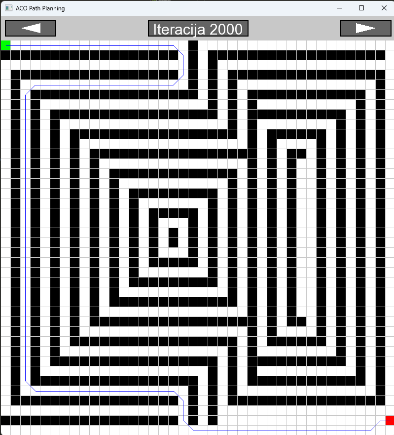

# ACO (Ant colony optimization) for path finding using CUDA

This project implements an Ant Colony Optimization (ACO) algorithm for robot path planning in a 2D grid environment. It demonstrates how a colony of agents can converge to an optimal path avoiding obstacles through pheromone deposition and evaporation.

## Requirements
- CMake >= 3.12
<!-- - Optional: NVIDIA CUDA TOOLKIT -->
<!-- - OpenCV (used for visualization) -->

